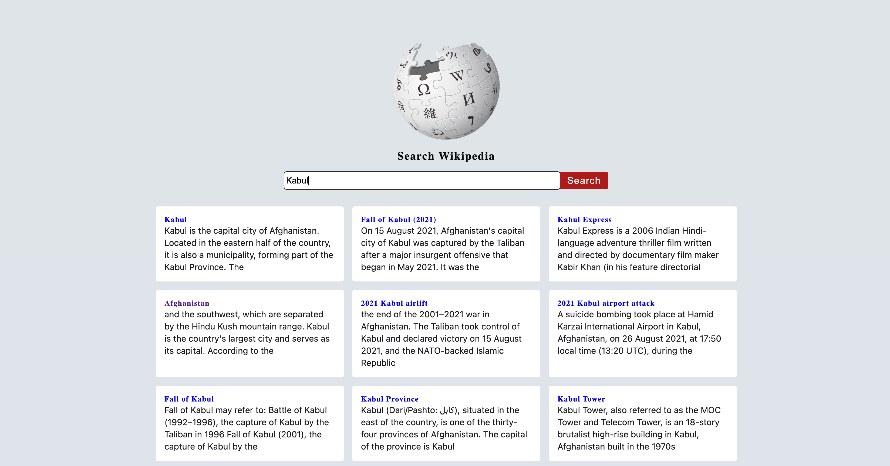

<h1>Lessons learned in this project</h1>
<h2>CSS</h2>
<ol>
Take care of how you want to align your contents, to have them all in same height

```css
.article {
	align-items: center;
}
```

## Image

To control the size of an image, it is best to use the `width` property instead of `height`

```css
.container img {
	width: 220px;
}
```

### Aligning the image and text in the container

```css
.container {
	text-align: center;
}

.container img {
	width: 200px;
	/* If did  */
	margin: 0 auto;
	margin-bottom: 1rem;
}
```

If we did not added

```css
img {
	display: block;
}
```

for image, we could have aligned the image just as text using `text-align:center`.

## Standard search bars

```html
<form class="form-search">
	<input type="text" name="input" id="input-form" class="input-value" />
	<button class="submit-btn btn">search</button>
</form>
```

```css
.container h3 {
	margin-bottom: 1rem;
	font-size: 1.3rem;
	text-transform: capitalize;
}

.form-search {
	display: grid;
	grid-template-columns: auto 90px;
	background: white;
	max-width: var(--fixed-width);
	margin: 0 auto;
	border-radius: var(--border-radius);
}

.input-value {
	/* To have a beautiful alignment with button at the same line */
	outline: none;
	line-height: 2;
	font-size: 1rem;
	padding-left: 0.21rem;
	border: transparent;
	border-radius: var(--border-radius);
}

.input-value:focus {
	outline: 1px solid var(--clr-grey-4);
}

.submit-btn {
	border: 0.11px solid var(--primary-5);
	border-left: transparent;
	border-top-right-radius: var(--border-radius);
	border-bottom-right-radius: var(--border-radius);
	text-transform: capitalize;
	background: var(--clr-primary-5);
	color: var(--clr-white);
	transition: var(--transition);
	cursor: pointer;
	letter-spacing: var(--spacing-wide);
	font-size: 1.09rem;
}

.submit-btn:hover {
	background: var(--clr-primary-6);
}
```

<figure>

<figcaption><p align="center">finished work</p><figcaption>
</figure>

<!-- HTML before adding them dynamically -->

```html
<!DOCTYPE html>
	<body>
		<section class="wiki">
			<!-- container -->
			<div class="container">
				
				<h3>search wikipedia</h3>
				<!-- form -->
				<form class="form-search">
					<input type="text" name="input" id="input-form" class="input-value" />
					<button class="submit-btn btn">search</button>
				</form>
			</div>
			<!-- result -->
			<div class="results">
				<article class="articles">
					<a href="#" target="_blank">
						<h4 class="article-title">hello</h4>
						<p class="article-content">
							Lorem ipsum dolor sit amet consectetur adipisicing elit. Quisquam
							blanditiis illum voluptas expedita aliquid minus
							exercitationemditiis illum voluptas expedita aliquid minus ror, et
							mollitia.
						</p>
					</a>
				</article>
			</div>
		</section>
		<script type="module" src="./app.js"></script>
	</body>
</html>
```
